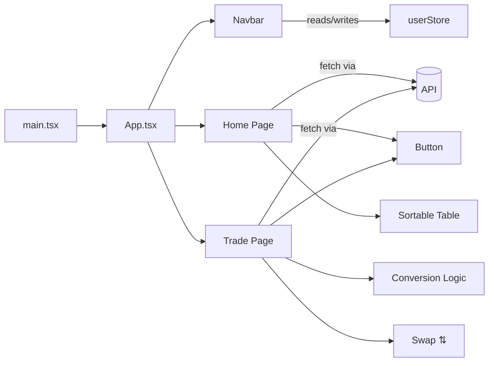

# 🚀 Crypto Exchange React App

A React + TypeScript crypto dashboard built with **Vite** and **Tailwind CSS**.  
It allows users to browse live cryptocurrency data and perform simple conversions (crypto ↔ USD).

🔗 **Live Demo:** [Crypto Exchange](https://vraj79.github.io/crypto/)

---

## 📑 Table of Contents

1. [Overview](#overview)
2. [Features](#features)
3. [Installation](#installation)
4. [File-by-File Breakdown](#file-by-file-breakdown)
   - vite-env.d.ts
   - types/coin.ts
   - store/userStore.ts
   - components/Button.tsx
   - components/InputField.tsx
   - components/Navbar.tsx
   - pages/Home.tsx
   - pages/Trade.tsx
   - App.tsx
   - main.tsx
5. [Component & Data Flow](#component--data-flow)
6. [Conclusion](#conclusion)

---

## 📖 Overview

This app demonstrates a **crypto exchange dashboard** where users can:

- View live market data
- Sort and paginate coins
- Convert between cryptocurrency and USD
- Access protected trade features (login required)

Built with:

- **React Router** → for navigation
- **Zustand** → for lightweight state management
- **Axios** → for API requests
- **TypeScript** → for strong typing
- **Tailwind CSS** → for styling

---

## ✨ Features

- 🔐 **Authentication with Zustand (persisted state)**
- 📊 **Sortable crypto table (Name & Price)**
- 📈 **Live price-based conversion (Crypto ↔ USD)**
- 🔄 **Swap conversion direction**
- 🖼️ **Reusable UI components (Button, InputField, Navbar)**
- 📱 **Responsive Tailwind design**
- 🚧 **Protected Trade route (login required)**

---

## ⚙️ Installation

Clone the repository and install dependencies:

```bash
git clone https://github.com/vraj79/crypto.git
cd crypto
npm install
```

Run the development server:

```bash
npm run dev
```

Build for production:

```bash
npm run build
```

Preview the build locally:

```bash
npm run preview
```

---

## 📂 File-by-File Breakdown

### **vite-env.d.ts**

Provides type declarations for Vite environment variables.

### **types/coin.ts**

Defines the structure of cryptocurrency objects used across the app.

### **store/userStore.ts**

Zustand store to manage persistent authentication state (`login`, `logout`).

### **components/Button.tsx**

Reusable Tailwind-styled button component.

### **components/InputField.tsx**

Standardized input with label and focus styling.

### **components/Navbar.tsx**

Navigation bar with login modal, logout, and route switching.

### **pages/Home.tsx**

Displays top cryptocurrencies in a sortable and paginated table.

### **pages/Trade.tsx**

Conversion tool for crypto ↔ USD with protected access (requires login).

### **App.tsx**

Root component managing routes and authentication guard.

### **main.tsx**

Entry point: mounts app, applies routing, and loads global styles.

---

## 🌐 Component & Data Flow



---

## 🏁 Conclusion

This project is a solid starting point for a **crypto trading dashboard**. Its modular design—typed models, centralized store, reusable components, and routed pages—makes it easy to extend with features such as:

- Real “Buy/Sell” flows
- Detailed coin analytics pages
- Enhanced authentication
- Data visualizations (charts, graphs)

🔗 **Try it live here:** [Crypto Exchange](https://vraj79.github.io/crypto/)
