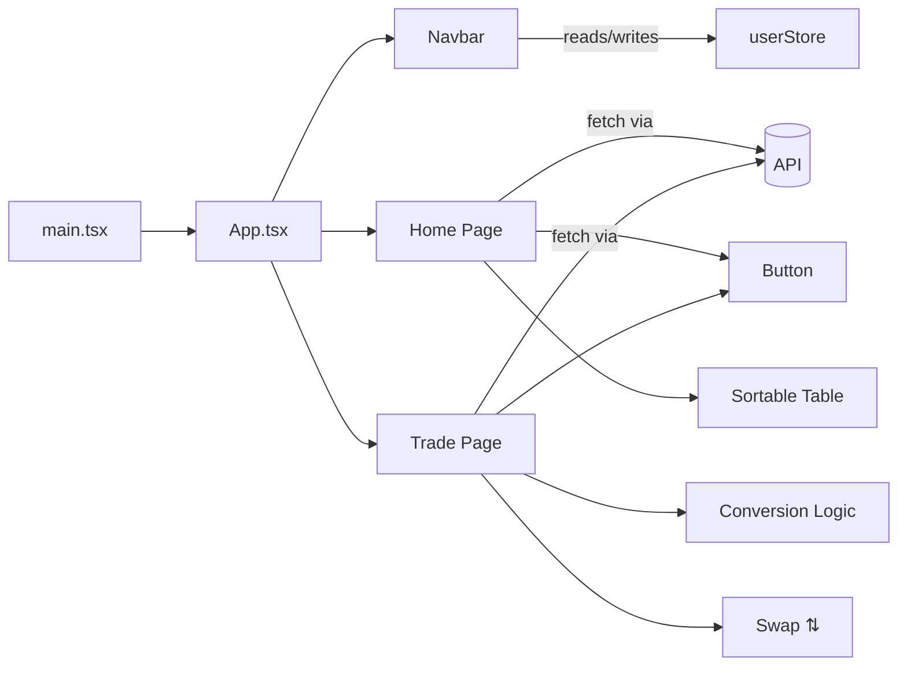

# Crypto trading app

## Introduction
It is a cryptocurrency exchange web application built using React, Vite, and TypeScript. It provides users with an interactive interface to view and trade crypto assets. The application features a dashboard that displays real-time coin data from an external API and a dedicated trade page that allows conversion between crypto and fiat currencies. State management is handled by Zustand, while styling is implemented using Tailwind CSS.

## Features

- **Crypto Dashboard:** An interactive home page to view a list of cryptocurrencies with their icons, names, and current prices.
- **Sortable Assets List:** Users can sort cryptocurrencies by name or price. Toggle the sort order with a simple click.
- **Trade Interface:** A dedicated trade page to convert between crypto and fiat currencies (USD). A swap feature enables quick switching between conversion directions.
- **User Authentication:** A simple login modal is provided. Once logged in, users can access the trade page.
- **Responsive Design:** The interface is styled with Tailwind CSS for a modern and responsive look.
- **State Management:** Utilizes Zustand for managing user state and global data persistence.
- **API Integration:** Coin data is fetched using Axios from an API endpoint defined by an environment variable.

## Requirements

Before running the application, ensure you have the following installed on your system:

| **Tool**       | **Version or Higher**        |
| -------------- | ---------------------------- |
| Node.js        | 14.x or later                |
| npm or Yarn    | Latest stable version        |

Other dependencies managed by npm include React, React Router DOM, Axios, Zustand, and Tailwind CSS.

## Installation

Follow these steps to set up the project locally:

1. **Clone the Repository:**
   ```bash
   git clone https://github.com/vraj79/crypto.git
   cd crypto
   ```

2. **Install Dependencies:**
   ```bash
   npm install
   ```
   or if you prefer Yarn:
   ```bash
   yarn
   ```

3. **Set Up Environment Variables:**
   Create a `.env` file in the root of the project and add the following variable:
   ```env
   VITE_API_URL=<your_api_endpoint>
   ```

4. **Run the Development Server:**
   ```bash
   npm run dev
   ```
   This command starts the Vite development server.

## Usage

Once the project is installed and the development server is running, here is how to get started:

- **Home Page:**
  - Visit the root URL (http://localhost:3000 or as shown in your terminal).
  - Browse the list of crypto assets. You can sort by clicking on the column headers.
  - Load more assets by clicking the "Load More" button.

- **Trade Page:**
  - Click on the "Trade" menu item in the navigation bar.
  - If not logged in, a login modal will prompt you to enter your credentials.
  - After logging in, access the conversion interface to swap between crypto and fiat amounts.
  - Use the swap button to toggle the conversion direction.

- **Navigation and Authentication:**
  - The dynamic navbar provides easy access to the Home and Trade pages.
  - Log in using a simple email and password form. The provided authentication is minimal and managed through a Zustand store.

## 🌐 Component & Data Flow  



---

## Configuration

This repository uses several configuration files to manage the development environment:

- **Vite Configuration:**
  - The project uses Vite for fast development and build processes. Check `vite.config.ts` for plugin configurations.
  
- **Tailwind CSS:**
  - Styling is managed using Tailwind CSS. The `tailwind.config.js` file specifies the content paths and theme extensions.
  
- **PostCSS:**
  - PostCSS and Autoprefixer are configured in `postcss.config.js`.
  
- **ESLint:**
  - Code linting is enforced using ESLint configured in `eslint.config.js` with support for React hooks and TypeScript.
  
- **TypeScript:**
  - The project is written in TypeScript. Configuration for the compiler is available in `tsconfig.json` and `tsconfig.app.json`.

- **Zustand Persistence:**
  - User state is managed via Zustand with persistence enabled through middleware. The configuration resides in `src/store/userStore.ts`.

-----------------------------------------------------------------------------------------------------------------

🔗 **Try it live here:** [Crypto Exchange](https://vraj79.github.io/crypto/)